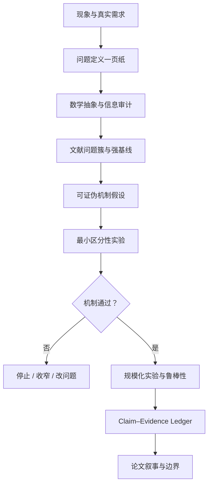

# Research Craft & AI4M Knowledge Base

> 这个仓库不以“收集了多少论文”为目标，而以建立可检验、可复用、可持续更新的研究判断为目标。  
> 当前重点：**晶体生成 / 晶体结构预测 / AI for Materials**；原有 AutoResearch 与 AI4M 资料继续保留。

## 为什么建立这个仓库

论文、模型名和故事不是研究知识的最小单位。真正可积累的单位是：

\[
\boxed{
\text{问题}
+
\text{变量}
+
\text{假设}
+
\text{机制}
+
\text{证据}
+
\text{反例}
+
\text{适用边界}
}
\]

当知识以论文名为单位时，idea 容易退化为 “A 模型 + B 模型”。  
当知识以问题结构为单位时，才可能回答：

- 世界中真正未知的对象是什么？
- 现有数据是否包含解决它所需的信息？
- 目标函数与科学目标是否一致？
- 新模块到底改变了什么？
- 哪个实验能证明我们的解释是错的？
- 在什么条件下结论停止成立？

---

## 什么是一个好的研究者

好的研究者并不是最会复述论文故事的人，而是能够持续完成以下转换的人：

### 1. 把“现象”改写成“问题”

“模型不够稳定”“LLM 不会物理”“Diffusion 缺少反馈”都只是现象描述。  
一个可研究的问题至少要明确：

\[
\mathcal P =
(\text{input},\text{output},\text{state space},\text{objective},
\text{budget},\text{oracle},\text{success criterion})
\]

例如，与其说“生成更稳定的晶体”，不如问：

> 给定化学组成与最多 \(B\) 次物理评估，如何输出 \(K\) 个弛豫后落入不同势阱、且能量位于低能窗口内的候选？

### 2. 区分真实科学目标与 benchmark 代理

研究中必须维护下面的分层：

| 层次 | 核心问题 |
|---|---|
| 真实世界 | 客观系统如何运行？ |
| 科学目标 | 我们真正想发现或解释什么？ |
| 观测过程 | 数据怎样被实验、计算和选择过程产生？ |
| 数学任务 | 输入、输出、状态空间和效用如何定义？ |
| 算法 | 用什么计算过程逼近目标？ |
| 评价器 | 用什么代理判断成功？ |
| 论文结论 | 证据最多允许声称到哪一层？ |

任何从“benchmark 提升”直接跳到“解决科学问题”的叙述，都需要额外证据。

### 3. 主动寻找最危险的替代解释

看到提升时，先问它是否来自：

- 更多数据或更强预训练；
- 更多参数、采样次数或 oracle 调用；
- 更有利的后处理与筛选器；
- train/test 泄漏、同组成或同原型重复；
- evaluator 偏差或 reward hacking；
- 一个更简单的检索、替换、随机或规则基线。

真正的机制贡献必须通过区分性实验排除这些解释。

### 4. 在实验前写出“什么会证明我错了”

一个机制假设必须同时包含：

\[
H:\quad A \Rightarrow B
\]

和它的反证条件：

\[
F:\quad \text{若控制 } C \text{ 后移除 } A,\ B \text{ 不变，则 } H \text{ 不成立}
\]

杀手实验不是论文末尾的补丁，而应决定项目是否值得继续。

### 5. 让结论强度服从证据强度

建议维护 claim ledger：

| Claim | 必需证据 | 当前证据 | 状态 |
|---|---|---|---|
| 模型改善 benchmark | 统一设置下的复现与统计 |  | 未验证 |
| 核心机制有效 | 反事实消融与危险基线 |  | 未验证 |
| 物理质量提高 | 独立 evaluator / DFT / 实验 |  | 未验证 |
| 发现新科学 | 排除记忆、替换和已知规律 |  | 未验证 |

论文故事只能写到已通过的证据层级。

### 6. 知道问题的适用边界

明确温度、压力、组成范围、数据分布、计算预算、oracle 精度和目标场景。  
“在固定组成、零压、近零温、有限 DFT 预算下改善低能多晶型搜索”通常比“实现通用材料发现”更可信，也更容易形成深刻贡献。

---

## What–Why–How++：研究前必须回答的六个问题

### What — 问题究竟是什么？

- 输入、输出和状态空间是什么？
- 是预测单点、生成分布、搜索集合，还是学习策略？
- 成功以单样本、Top-\(K\)、覆盖率还是固定预算衡量？

### Why — 为什么值得做？

- 哪个真实科学/计算流程受阻？
- 现有任务定义或评价为什么无法反映该需求？
- 解决后会改变什么决策、计算成本或科学认识？

### How — 为什么这个方法能解决？

方法应写成因果链，而不是组件清单：

\[
\text{困难来源}
\rightarrow
\text{新增信息/结构}
\rightarrow
\text{改变数学问题}
\rightarrow
\text{可观察改进}
\]

### Assumptions — 在什么假设下成立？

列出数据代表性、oracle 可靠性、不变性、可辨识性、计算预算和外推范围。

### Falsification — 什么会证明它没用？

提前写出最危险基线、替代解释和 kill criterion。

### Boundary — 到哪里停止成立？

明确论文不解决的任务，避免用宏大背景掩盖有限证据。

---

## 如何把故事抽象成数学

设原任务为 \(X\rightarrow Y\)，引入中间变量 \(Z\)：

\[
X \xrightarrow{A} Z \xrightarrow{B} Y
\]

A+B 只有在下列条件至少近似成立时才有意义：

\[
I(Z;Y\mid X)>0,
\qquad
H(Y\mid X,Z)<H(Y\mid X)
\]

也就是：

1. \(Z\) 对最终目标提供了输入 \(X\) 之外的信息；
2. 给定 \(Z\) 后，原问题确实更简单；
3. A 与 B 承担不同、可辨识、可单独验证的职责；
4. 简单替代 \(Z\) 不能取得相同结果。

因此，“LLM + Diffusion + RL”不是研究问题；  
“离散模型负责跨结构模式分配概率，连续模型负责模式内几何实现，集合级目标防止低能奖励导致模式坍缩”才是可审计的模型分工。

---

## 如何判断一篇论文真正改变了什么

本仓库采用六维贡献向量：

\[
\Delta =
(\Delta P,\Delta I,\Delta O,\Delta C,\Delta E,\Delta K)
\]

| 维度 | 含义 |
|---|---|
| \(\Delta P\) | 是否重新定义问题或任务 |
| \(\Delta I\) | 是否引入此前缺失的信息、数据或表示 |
| \(\Delta O\) | 是否提出新的目标、算法原语或机制 |
| \(\Delta C\) | 是否实质改变计算效率、规模或可部署性 |
| \(\Delta E\) | 是否改变评价标准和证据门槛 |
| \(\Delta K\) | 是否产生新的科学知识或可验证规律 |

据此区分：

- **开山 / 问题定义型**：改变后续研究必须使用的坐标系；
- **机制 / 表示型**：提出可复用的数学原语；
- **数据 / 评价型**：改变什么证据才算进步；
- **规模 / 系统型**：把方法推进到此前无法达到的验证层级；
- **故事整合型**：组合已有模块，价值取决于是否有不可替代分工；
- **生存性增量型**：主要更换 backbone、loss 或组件，问题与证据框架基本不变。

这些标签是研究分析，不是对论文或作者的道德评价。

---

## 一篇论文应怎样阅读

每篇论文都使用同一套十二项审计卡：

1. **Scientific problem**：真正要解决什么？
2. **Mathematical task**：输入、输出、状态空间、学习对象与目标是什么？
3. **Data-generating process**：数据如何产生，遗漏与偏差是什么？
4. **Core mechanism**：去掉命名后，真正的新算子是什么？
5. **Claim–evidence alignment**：每个 claim 由什么证据支持？
6. **Hidden assumptions**：哪些假设一旦失败，结论会崩溃？
7. **Strongest alternative explanation**：最简单的替代解释是什么？
8. **Missing baseline**：最危险的缺失基线是什么？
9. **Killer experiment**：什么实验最可能推翻核心机制？
10. **Contribution type**：它改变了问题、信息、目标、规模、评价还是知识？
11. **Transferable abstraction**：真正可迁移的数学结构是什么？
12. **Final verdict**：可信结论、过度叙述、适用边界和下一步分别是什么？

模板见 [templates/paper-audit-template.md](./templates/paper-audit-template.md)。

---

## 做一个高质量研究项目的工作流

### 项目启动前

- 写 [方向审计模板](./templates/direction-audit-template.md)；
- 写至少一个 [idea 反证模板](./templates/idea-falsification-template.md)；
- 建立数据、oracle、预算与评价的版本表；
- 先选危险基线，再选复杂方法；
- 先定义停止条件，再投入大规模训练。

### 实验过程中

- 每次实验只检验一个机制问题；
- 同时记录失败、负结果和 evaluator 变化；
- 不允许训练 reward 与最终审计指标完全同源；
- 所有方法共享数据、后处理和计算预算时再比较；
- 先分析 effect size 与置信区间，再讨论故事。

### 写论文之前

- 每个核心 claim 对应至少一项直接证据；
- 每个模块对应一个不可替代职责和反事实消融；
- 把“观察”“机制推断”和“科学解释”分开写；
- 主动列出最强反例和失效边界；
- 若故事必须依赖未经验证的形容词，说明证据链仍不够。

---

## 仓库导航

### 晶体生成与 CSP

| 入口 | 内容 |
|---|---|
| [crystal/README.md](./crystal/README.md) | 43 篇首轮审计论文索引：简介、论文、项目和逐篇报告 |
| [领域数学抽象](./crystal/landscape/00-field-mathematical-abstraction.md) | 状态空间、任务、数据、目标、oracle 与评价的统一形式化 |
| [去故事化总审计](./crystal/landscape/01-de-story-audit.md) | 各路线真正改变了什么、哪些区域拥挤、哪些 claim 站不住 |
| [开放问题](./crystal/landscape/02-open-problems.md) | 以 What–Why–How–Falsification 组织的研究机会 |
| [跨领域迁移图](./crystal/landscape/03-cross-domain-transfer-map.md) | CV / RL / 生成建模的数学原语如何迁移，哪些迁移是伪组合 |
| [评价协议](./crystal/landscape/04-evaluation-protocol.md) | 多晶型、预算、稳定性、新颖性与 evaluator robustness |
| [当前研究主线](./crystal/landscape/05-current-research-thesis.md) | 有限预算多势阱 CSP 的问题定义、方法假设与杀手实验 |

### 通用研究模板

| 模板 | 用途 |
|---|---|
| [论文审计](./templates/paper-audit-template.md) | 对单篇论文做十二项去故事化阅读 |
| [方向审计](./templates/direction-audit-template.md) | 对一个大方向做 What–Why–How++ 梳理 |
| [Idea 反证](./templates/idea-falsification-template.md) | 明确替代解释、危险基线和停止条件 |
| [实验决策](./templates/experiment-decision-template.md) | 记录一次实验究竟改变了哪个判断 |
| [Claim–Evidence Ledger](./templates/claim-evidence-ledger-template.md) | 控制论文结论强度 |
| [周研究日志](./templates/weekly-research-log-template.md) | 按问题、证据与决策积累，而非流水账 |

### 原有 AutoResearch / AI4M 资料

| 文档 | 说明 |
|---|---|
| [AutoResearch-导航概览.md](./AutoResearch-%E5%AF%BC%E8%88%AA%E6%A6%82%E8%A7%88.md) | 全库导航、项目列表、按研究对象阅读路径 |
| [AutoResearch-总体报告.md](./AutoResearch-%E6%80%BB%E4%BD%93%E6%8A%A5%E5%91%8A.md) | 总体技术趋势、时间线、分类图与架构分析 |
| [AutoResearch-来源索引.md](./AutoResearch-%E6%9D%A5%E6%BA%90%E7%B4%A2%E5%BC%95.md) | 论文、官网、仓库与证据级别 |
| [AutoResearch-机构实验室研究者路线图.md](./AutoResearch-%E6%9C%BA%E6%9E%84%E5%AE%9E%E9%AA%8C%E5%AE%A4%E7%A0%94%E7%A9%B6%E8%80%85%E8%B7%AF%E7%BA%BF%E5%9B%BE.md) | 按机构、实验室和研究者梳理路线 |
| [AutoResearch-研究者论文追踪矩阵.md](./AutoResearch-%E7%A0%94%E7%A9%B6%E8%80%85%E8%AE%BA%E6%96%87%E8%BF%BD%E8%B8%AA%E7%9F%A9%E9%98%B5.md) | 研究者/团队连续论文线 |
| [专用Autoresearch](./%E4%B8%93%E7%94%A8Autoresearch) | 面向特定科学任务的研究系统 |
| [通用Autoresearch](./%E9%80%9A%E7%94%A8Autoresearch) | 通用 research agent 与报告系统 |

---

## 证据与维护规则

### 证据优先级

- **A**：正式论文页、会议/期刊页面、官方数据与官方仓库；
- **B**：arXiv、作者项目页、模型卡、公开技术报告；
- **C**：社区实现、媒体与二手整理，只用作线索。

### 动态信息

论文版本、代码状态、数据规模和 benchmark 数字可能变化。每个报告必须记录：

- 最后核验日期；
- 使用的论文版本；
- 代码 commit 或 release；
- evaluator 版本；
- 哪些判断尚未经过独立复现。

“未核验到项目地址”不等于作者没有发布代码。

### 新增内容的最低标准

新增论文或 idea 不能只有摘要。至少应包含：

1. 问题与数学任务；
2. 数据和信息边界；
3. 核心机制；
4. 危险基线；
5. 杀手实验；
6. 可支持与不可支持的 claim；
7. 与已有问题簇的关系。

提交规范见 [CONTRIBUTING.md](./CONTRIBUTING.md)。

---

## 当前总判断

高水平研究不是先决定使用哪种热门方法，再寻找可以包装的科学故事。顺序应当是：

\[
\boxed{
\text{真实问题}
\rightarrow
\text{数学目标}
\rightarrow
\text{信息需求}
\rightarrow
\text{可证伪机制}
\rightarrow
\text{方法}
\rightarrow
\text{证据}
}
\]

仓库中的任何结论都允许被后续论文、复现或实验推翻。  
真正需要长期保存的不是“我曾经相信什么”，而是“什么证据改变了我的判断”。
