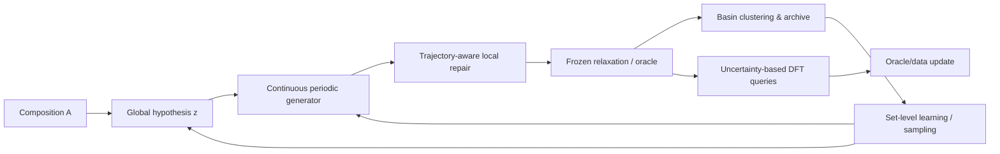

# 当前研究主线：有限预算、多势阱、可审计的晶体生成搜索

> [返回晶体索引](../README.md) · 工作假说版本：v1.0 · 2026-09-03  
> 这是一份可被实验推翻的研究主线，不是已经成立的论文结论。

## 0. 一句话问题

> **给定化学组成和有限物理评估预算，生成模型能否像真正的 CSP 搜索算法一样发现多个不同的低能势阱，同时保留神经生成模型的 amortized efficiency？**

建议工作标题：

- **Beyond Single-Target Recovery: Budgeted Multi-Basin Crystal Structure Search**
- **Landscape-Aware Generative Search for Diverse Low-Energy Crystal Polymorphs**

---

## 1. What：问题定义

### 1.1 输入

\[
x=(A,P,T,B)
\]

其中：

- \(A\)：固定化学组成；
- \(P,T\)：物理条件，首版可固定零压/近零温；
- \(B\)：物理评估预算，包括 MLIP energy/force、relaxation 与 DFT。

### 1.2 输出

\[
\mathcal S_B(A)
=
\{s_1,\ldots,s_K\},
\qquad
s_i=(A,X_i,L_i)
\]

经统一弛豫：

\[
s_i^*=R_\phi(s_i)
\]

聚类为不同 basin：

\[
b_i = b(s_i^*)
\]

### 1.3 目标

低能 basin archive：

\[
\mathcal A_B
=
\{(b_j,E_j,\sigma_j,n_j)\}
\]

集合效用：

\[
J_B
=
\mathbb E
\left[
\sum_j
w(E_j,\sigma_j)
\mathbf 1(n_j>0)
\right]
-
\lambda\,\mathrm{Redundancy}
-
\gamma\,C_B
\]

其中：

- \(E_j\)：basin 代表结构能量；
- \(\sigma_j\)：oracle 不确定性；
- \(n_j\)：该 basin 的访问次数；
- \(C_B\)：计算成本。

### 1.4 不解决什么

首版不直接声称：

- 完整有限温度相图；
- 合成动力学与实验可合成性；
- 任意元素、任意原子数的通用 de novo 发现；
- 生成轨迹等于真实分子动力学；
- 单一 MLIP reward 等于 DFT 真值。

---

## 2. Why：为什么当前任务定义不足

### 2.1 单参考恢复不是完整 CSP

数据库往往只记录有限多晶型。  
单参考 Match Rate 优化：

\[
\max_\theta
P_\theta(s_{\mathrm{ref}}\mid A)
\]

会把未记录但合理的低能 basin 判错。

### 2.2 Energy-only 后训练可能损害覆盖

\[
\max_\theta
\mathbb E[-E(s)]
\]

会倾向于把概率集中到少数 evaluator 最优结构。  
平均能量下降可能伴随：

\[
H(B)\downarrow
\]

即 basin entropy 和 Top-\(K\) 覆盖下降。

### 2.3 传统 CSP 与神经生成的优势没有统一比较

传统搜索按 oracle 调用探索，生成模型按训练后采样报告。  
真正应比较：

\[
\mathrm{UniqueLowEnergyBasins}(B)
\]

随物理评估预算 \(B\) 的曲线，以及训练成本的 break-even。

### 2.4 当前评价无法区分 searcher 与 relaxer

物理指导可能只让初始结构更接近局部极小值：

- 最大力更低；
- 弛豫步数更少；
- 但最终 basin 数不变。

这说明模型改善 local repair，而没有改善 global exploration。

---

## 3. 核心科学与方法假设

## H1：多势阱 CSP 需要集合级目标

### 假设

basin-aware set objective 相较 energy-only reward，在相近最佳能量下保留更多低能 basin。

### 可观察预测

- energy-only：best/mean energy 改善，但 duplicate-to-basin ratio 上升；
- basin-aware：unique basin coverage 上升，best energy 不显著恶化；
- 在 Top-\(K\) 候选上，coverage AUC 更高。

### 反证

若 energy-only 在所有预算下同时达到相同或更高 coverage，集合级目标没有必要。

---

## H2：全局模式分配与局部修正可被分离

### 假设

中间状态对最终 basin 的信息随时间增加：

\[
I(S_t;B\mid A)\uparrow
\]

而局部力/应力在后段继续下降。

### 可观察预测

- 早期分支采样产生多个 basin；
- 晚期分支多落入同一 basin；
- 早期干预粗结构/lattice 更易改变 basin；
- 后期 force correction 主要降低弛豫成本。

### 反证

若 basin branching entropy 与时间无稳定关系，或局部模块经常跨 basin，则简单阶段分工不成立。

---

## H3：结构化离散假设可降低连续多峰难度

引入：

\[
z=
\text{coarse structural hypothesis}
\]

分解：

\[
p(X,L\mid A)
=
\sum_z
p_\psi(z\mid A)
p_\theta(X,L\mid A,z)
\]

### \(z\) 的候选定义

优先从可验证、低歧义变量开始：

- 配位图或配位数分布；
- 局部环境类型计数；
- 元素—环境分配；
- 连通拓扑；
- 粗晶格形态；
- basin/prototype family embedding。

不应一开始就依赖长自然语言 CoT。

### 可观察预测

\[
I(z;B_{\mathrm{final}}\mid A)>0
\]

且给定 \(z\) 后连续生成更容易：

- condition-specific entropy 降低；
- Match/coverage 提高；
- 采样 NFE 或模型容量下降；
- 不同 \(z\) 产生不同 basin。

### 反证

随机 \(z\)、检索 prototype 或小 Transformer 与 LLM 相同，说明 LLM/复杂离散模块没有不可替代贡献。

---

## H4：轨迹/force 数据改善局部物理修正

### 假设

真实非平衡与弛豫轨迹数据，相较等量随机加噪终点，更能降低初始力、应力与弛豫成本。

### 可观察预测

- 最大力下降；
- 弛豫步数下降；
- 收敛率提高；
- 在同一 basin family 内结构质量提高；
- OOD 非平衡区域的 MLIP 误差下降。

### 反证

若随机噪声等量数据达到同效，则“真实轨迹”没有独立信息；  
若 basin coverage 不升，应将模块定位为 pre-relaxer，而非 CSP 搜索。

---

## H5：提升跨 evaluator 成立

### 假设

改进不是针对单一 MLIP 的 reward hacking。

### 可观察预测

- 第二 MLIP 保持排序；
- DFT representative subset 保持提升；
- 高 reward 样本不集中在最高不确定区域；
- 不同 relaxer 设置下结论稳定。

### 反证

换 evaluator 后排名翻转或 DFT 优势消失，则主 claim 不成立。

---

## 4. 方法架构：只保留有独立职责的模块



## 4.1 Module A：Global hypothesis generator

目标：

\[
z\sim p_\psi(z\mid A)
\]

职责：

- 在全局结构模式之间分配概率；
- 提供可解释、可干预的粗结构变量；
- 不直接承担精确坐标弛豫。

候选实现：

1. 频率/检索基线；
2. 小型结构 Transformer；
3. 离散 diffusion / MaskGIT；
4. LLM；
5. GFlowNet/quality-diversity proposal。

**LLM 不预设为必需。**  
只有超过检索和参数量匹配小模型时才保留 LLM claim。

## 4.2 Module B：Continuous periodic generator

目标：

\[
(X,L)
\sim
p_\theta(X,L\mid A,z)
\]

候选实现：

- 现有 DiffCSP/FlowMM 风格 backbone；
- Flow Matching；
- Stochastic Interpolants。

职责：

- 在给定 \(z\) 的条件子分布内生成周期几何；
- 不负责定义多势阱目标；
- 不被解释为物理 force。

首版应基于成熟开源基线，避免把 backbone 重写作为主要风险。

## 4.3 Module C：Trajectory-aware local repair

向量场分解：

\[
v_t
=
v_{\mathrm{gen},t}
+
\alpha_t(S_t)
v_{\mathrm{phys},t}
\]

其中：

\[
v_{\mathrm{phys}}
\approx
f(E,F,\sigma,\text{trajectory})
\]

职责：

- 减少 basin 内几何错误；
- 降低最大力/应力和弛豫成本；
- 由轨迹消融验证。

不允许用“沿真实势能面生成”作为默认表述。

## 4.4 Module D：Basin archive

每个候选弛豫后得到：

\[
(b_j,E_j,\sigma_j,\text{novelty}_j)
\]

archive 负责：

- 弛豫后去重；
- 统计 basin visits；
- 记录能量与不确定性；
- 构造集合级学习信号；
- 防止重复采样同一模式。

## 4.5 Module E：Set-level learning

可选方法按简单到复杂排列：

1. archive-balanced replay；
2. reward-weighted fine-tuning；
3. quality-diversity；
4. entropy-regularized RL；
5. coverage-aware GRPO/DDPO；
6. GFlowNet / reward-proportional learning；
7. inference-time tree/branch search。

先用最简单方法验证 H1，再决定是否需要复杂 RL。

## 4.6 Module F：Multi-fidelity oracle

推荐三层：

- **L0**：快速几何/价态检查；
- **L1**：MLIP-A energy/force/relaxation；
- **L2**：MLIP-B + uncertainty；
- **L3**：代表性 DFT；
- **L4**：小规模 phonon。

训练 reward 与最终审计层分离。

---

## 5. 数据设计

## 5.1 稳定终点

用途：

- 学习数据库结构先验；
- 训练主生成模型；
- 建立 reference/prototype。

风险：

- 缺少失败和跨 basin 信息。

## 5.2 非平衡数据

可来自 OMat24、MP-ALOE 等，或自建 MLIP/DFT 构型。

用途：

- 覆盖高力、高能、应力和 OOD 区域；
- 训练局部修正与 oracle 校准。

## 5.3 弛豫轨迹

可来自 LeMat-Traj 或统一 relaxer 生成。

必须记录：

- 初始来源；
- 优化器；
- 步长与收敛；
- cell 是否自由；
- 每一步能量/力/应力；
- 最终 basin。

## 5.4 自生成数据

只有通过下列之一获得新信息才算 self-improving：

- 新 DFT 标签；
- 新 phonon 标签；
- 新实验反馈；
- 新 basin 的可信 oracle 验证。

仅把模型样本按同一 reward 过滤后 SFT，应称为 iterative alignment，而非强意义自提升。

---

## 6. Basin 定义

单一 StructureMatcher 不够。建议组合：

\[
b(s)
=
\mathrm{Cluster}
[
\text{normalized structure},
\text{coordination graph},
\text{local environment},
E
]
\]

### 分层口径

- B0：严格 StructureMatcher；
- B1：等价晶胞归一化；
- B2：配位/拓扑；
- B3：能量邻近且可由局部弛豫互达；
- B4：DFT 复核的多晶型。

必须做阈值敏感性，并人工审查边界样本。

---

## 7. 评价主指标

### Primary endpoint

\[
\mathrm{AUC}_{\mathrm{basin}}(B)
=
\int_0^{B_{\max}}
\mathrm{UniqueLowEnergyBasins}(b)\,db
\]

或离散近似。

### Secondary endpoints

- best energy vs budget；
- energy-weighted basin coverage；
- duplicate-to-basin ratio；
- basin entropy；
- initial max force；
- relaxation steps；
- MLIP-A/B agreement；
- DFT pass rate；
- substitution/prototype-aware novelty；
- phonon pass on selected subset；
- amortized break-even。

### 不作为单独主指标

- validity；
- single-reference Match Rate；
- average energy；
- binary SUN；
- raw pairwise diversity。

这些仍报告，但不能单独支撑 CSP 搜索 claim。

---

## 8. 必须比较的基线

### Proposal 基线

- random legal；
- composition-matched prototype retrieval；
- ion substitution；
- train-frequency \(z\)；
- random \(z\)；
- small Transformer；
- LLM；
- oracle \(z\)。

### Search 基线

- best-of-\(N\)；
- rejection sampling；
- archive-balanced sampling；
- entropy-RL；
- quality-diversity；
- GRPO/DDPO；
- traditional CSP representative subset。

### Repair 基线

- no repair；
- external MLIP relaxation；
- endpoint-noise training；
- off-equilibrium；
- real trajectory；
- force/stress variants。

### Evaluator 基线

- MLIP-A；
- MLIP-B；
- ensemble；
- DFT subset。

---

## 9. 杀手实验优先级

### Kill-1：简单 proposal

固定连续 generator 与 evaluator，仅替换：

- LLM；
- small Transformer；
- retrieval；
- ion substitution；
- random。

若 LLM 不赢，删除 LLM 强 claim。

### Kill-2：searcher vs relaxer

比较：

- unique basin；
- force；
- relaxation steps。

若只降低力，不提高 basin coverage，重新定位为 pre-relaxation。

### Kill-3：energy-collapse

观察 energy-only 后：

\[
\Delta E<0,\qquad
\Delta H(B)<0
\]

若发生，证明集合目标必要；若不发生，需解释为什么。

### Kill-4：evaluator shift

在 MLIP-B/DFT 上复核。若优势消失，停止模型故事，转向 evaluator/active-learning 问题。

### Kill-5：budget parity

严格等 oracle 调用与 wall-clock。若传统/简单搜索追平，说明优势是预算而非方法。

### Kill-6：novelty audit

排除训练重复、元素替换和已知 prototype。若剩余 N4 novelty 很低，不能声称新结构发现。

---

## 10. 最小实验路线

## Phase 0：评价与数据 sanity

- 选择 20–50 个具有多个已知/可搜索低能结构的 composition；
- 建立统一 MLIP-A relaxer；
- 构建 basin clustering；
- 复现 random/prototype/ion substitution/现有 generator；
- 绘制 coverage—budget 曲线。

**Gate：** basin 定义与评价不稳定则不训练新模型。

## Phase 1：H1 集合目标

在固定现有 generator 上比较：

- no post-training；
- energy-only；
- energy + entropy；
- archive-balanced；
- basin-aware reward。

**Gate：** basin-aware 必须在相近能量下提高 coverage。

## Phase 2：H4 轨迹数据

训练轻量 local repair：

- endpoint；
- endpoint + noise；
- off-equilibrium；
- trajectory；
- force/stress。

**Gate：** 真实轨迹必须有等数据量增益；否则降级。

## Phase 3：H3 离散假设

比较：

- random/频率；
- retrieval；
- small Transformer；
- LLM；
- oracle。

**Gate：** \(z\) 必须预测 basin；LLM 必须超过简单替代才进入主线。

## Phase 4：联合模型

只组合已通过 gate 的模块。  
不允许把失败模块为了故事完整性继续保留。

## Phase 5：多保真与 OOD

- MLIP-B；
- DFT subset；
- prototype/composition OOD；
- phonon subset；
- traditional CSP representative comparison。

---

## 11. 计算约束下的设计

当前个人上限约为 **4×A800**，因此首版应：

- 复用成熟 continuous generator；
- 先冻结 generator 验证 archive/set objective；
- 优先训练小型 proposal 与 repair 模块；
- 避免同时重训大 LLM 和大 diffusion；
- DFT 用 active selection，而非大规模盲算；
- 先做 20–50 composition 的高质量 controlled study；
- 只有机制 gate 通过后扩到标准数据集。

### 推荐资源分配

| 阶段 | GPU/计算重点 | 目的 |
|---|---|---|
| Phase 0 | MLIP 批量弛豫与聚类 | 建立可信任务 |
| Phase 1 | 冻结模型的采样/RL 小实验 | 验证目标函数 |
| Phase 2 | 轻量 repair 训练 | 验证轨迹信息 |
| Phase 3 | 小模型 vs LLM | 审计 LLM 必要性 |
| Phase 4 | 1 个 LLM + 1 个 continuous model | 只组合通过模块 |
| Phase 5 | DFT/phonon | 防 evaluator hacking |

---

## 12. 预期论文贡献

只有实验通过后，贡献可写成：

### Contribution 1：任务定义

将固定组成晶体预测从 single-reference recovery 形式化为 finite-budget multi-basin discovery，并建立对应评价协议。

### Contribution 2：集合级学习目标

提出 relaxation-aware basin archive 与 coverage-preserving set objective，解决 energy reward 与多晶型覆盖冲突。

### Contribution 3：可辨识的层级生成

将全局结构模式分配与局部连续物理修正分开，并通过中间轨迹干预证明各自职责。

### Contribution 4：多保真证据

在统一预算、传统搜索、双 MLIP、DFT、substitution-aware novelty 和动力学验证下审计提升。

### LLM 贡献的条件句

只有当 LLM 显著超过 retrieval 和参数量匹配小模型，且 \(z\) 对 basin 有可测信息时，才可写：

> LLM 提供可泛化的离散结构模式先验。

否则改写为：

> 结构化离散 proposal 改善模式分解。

---

## 13. 审稿人最可能的质疑

### “这只是又一个 RL 晶体生成器”

回答必须来自：

- 新任务定义；
- set-level basin objective；
- 直接证明 energy-collapse；
- 与 CrystalGRPO/已有 RL 的明确差异；
- RL 只是实现，不是贡献中心。

### “Basin 是人为定义的”

需要：

- 多口径聚类；
- 阈值敏感性；
- 结构拓扑 + 能量；
- DFT/人工边界复核；
- 结论对聚类口径稳健。

### “LLM 没有必要”

这不是需要辩论的问题，而是实验问题。  
若 LLM 不超过小模型，就删除该 claim。

### “MLIP reward 被利用”

需要：

- 独立 MLIP；
- uncertainty；
- DFT；
- ranking flip；
- prospective sampling。

### “传统 CSP 呢？”

必须在相同预算下比较至少代表性子集，并报告 amortized break-even。

### “数据库没有完整多晶型标签”

承认不完备，并结合：

- 已知多晶型集合；
- 传统搜索补充；
- MLIP landscape exploration；
- DFT 复核；
- reference-free basin discovery 指标。

---

## 14. 项目决策规则

```text
若评价口径不稳定：
    停止训练，先做 benchmark。

若 energy-only 不损害 coverage：
    集合目标不是主贡献，重新审视问题。

若 trajectory 不超过随机噪声：
    删除“真实轨迹机制”或定位为工程。

若 LLM 不超过 retrieval/small model：
    删除 LLM 强 claim。

若优势不能跨 MLIP/DFT：
    转向 evaluator calibration / active learning。

若简单/传统搜索同预算追平：
    收窄到特定 OOD 或计算区间。

只有所有保留模块通过各自 kill test：
    才进行联合大实验和论文叙事。
```

---

## 15. 当前最重要的下一步

不是立即训练 LLM、Diffusion 或 GRPO，而是：

1. 选择可获得多 basin 证据的 composition 子集；
2. 建立弛豫后 basin archive；
3. 用现有 generator、原型、离子替换和随机搜索绘制 budget curve；
4. 证明 energy quality 与 basin coverage 是否真的冲突；
5. 之后才决定使用 archive reweighting、RL 或 GFlowNet；
6. 同时做小规模轨迹分支实验，验证 global/local 可分性。

这个顺序把方法选择建立在问题证据上，而不是建立在方法流行度上。
